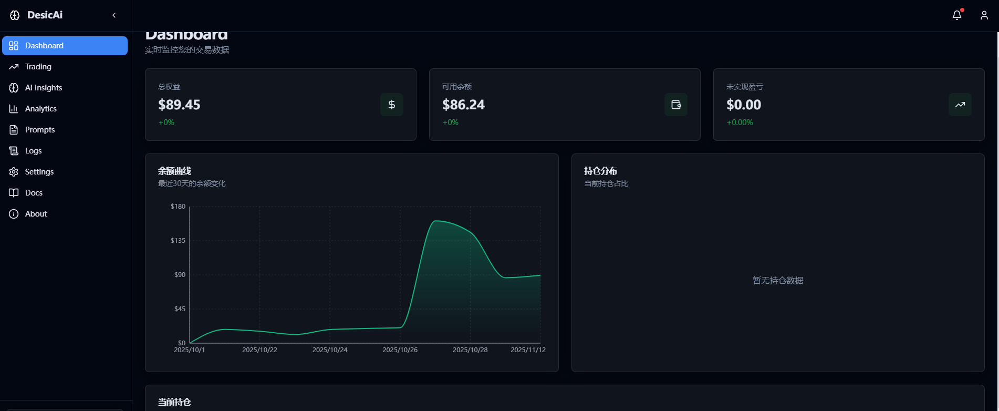
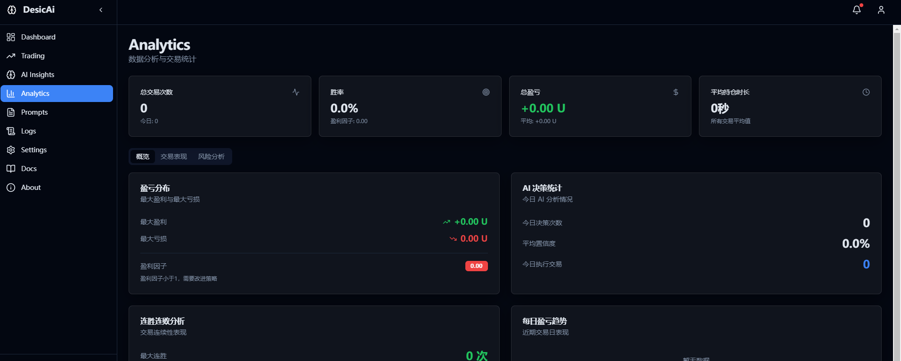
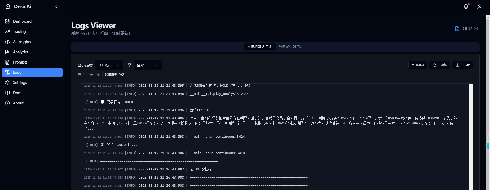
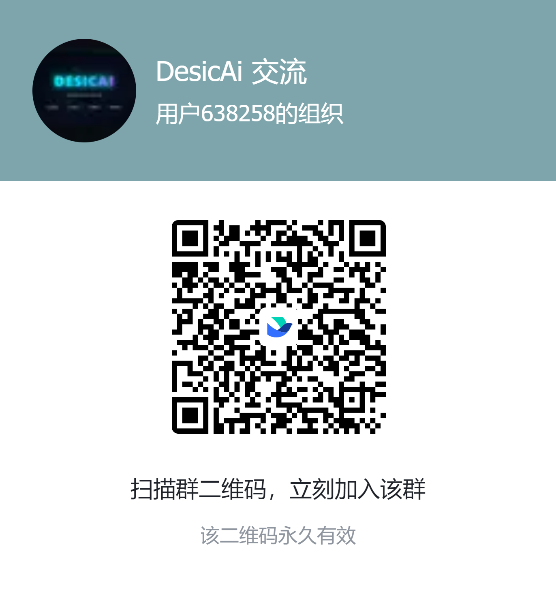

# DesicAI - AI-Powered Cryptocurrency Automated Trading System

[](LICENSE)
[](https://www.python.org/downloads/)
[](https://github.com/psf/black)

> An artificial intelligence-based cryptocurrency quantitative trading system supporting OKX Exchange, integrating real-time data collection, AI decision analysis, and automated trade execution.

English | [简体中文](README.md)

## ✨ Features

- 🤖 **AI-Driven Decisions**: Support for multiple AI models including Doubao, DeepSeek, and Qwen for intelligent market analysis
- 📊 **Real-time Data Collection**: 24/7 continuous collection of candlestick data, order books, and tick-by-tick trades
- 🎯 **Automated Trading**: Execute opening, closing, take-profit, and stop-loss operations based on AI decisions
- 🖥️ **Web Management Interface**: Intuitive visual interface for one-click configuration and control of all components
- 🔒 **Risk Management**: Multi-layer take-profit and stop-loss strategies with intelligent position management
- 📈 **Multi-Timeframe Analysis**: Combining short-term (5-minute) and long-term (4-hour) multi-dimensional technical indicators
- 💾 **Data Persistence**: Efficient data storage solution based on MySQL and Redis
- 🌐 **Proxy Support**: HTTP proxy support for network accessibility

## 📋 Table of Contents

- [Exchange Registration](#-exchange-registration)
- [Deployment Service](#-deployment-service)
- [System Architecture](#-system-architecture)
- [Interface Preview](#-interface-preview)
- [Quick Start](#-quick-start)
- [Installation](#-installation)
- [Configuration](#-configuration)
- [User Guide](#-user-guide)
- [FAQ](#-faq)
- [Contributing](#-contributing)
- [License](#-license)
- [Disclaimer](#-disclaimer)

## 📝 Exchange Registration

Before using this system, you need to register an exchange account. Register through our exclusive links to get trading fee rebates!

### OKX Exchange

<div align="center">
</div>

**Registration Link:** https://www.oyuzh.com/zh-hans/join/xiazhi?shortCode=6CngT5

**Advantages:**
- ✅ Trading fee rebates
- ✅ Good liquidity and depth
- ✅ Stable and reliable API
- ✅ Multiple contract products

**Registration Steps:**
1. Click the link above to visit the registration page
2. Enter your email/phone number to register
3. Complete identity verification (KYC)
4. Deposit USDT to your futures account
5. Go to **Personal Center** → **API** → **Create API** to get your API keys

### Binance

<div align="center"></div>

**Registration Link:** https://www.binance.com/join?ref=XAZHI

**Advantages:**
- ✅ Trading fee rebates
- ✅ World's largest exchange
- ✅ Rich variety of trading pairs
- ✅ Multi-language support

**Registration Steps:**
1. Click the link above to visit the registration page
2. Enter your email/phone number to register
3. Complete identity verification (KYC)
4. Deposit USDT to your futures account
5. Create API keys in **API Management**

> **Note:** Currently, the system primarily supports OKX Exchange. Binance support is under development.

---

## 💼 Deployment Service

**For users unfamiliar with technical details, we provide one-on-one deployment services!**

### Service Contents

- ✅ Complete environment setup (Python + MySQL + Redis)
- ✅ System configuration and debugging
- ✅ API key configuration
- ✅ Trading parameter optimization recommendations
- ✅ Usage training and Q&A
- ✅ Ongoing technical support

### Contact Information

<div align="center">

**WeChat: lmyc11223344**

*Please add a note: DesicAI Deployment*

</div>

---

## 🏗️ System Architecture

DesicAI consists of three core components:

```
┌─────────────────────────────────────────────────────────────┐
│                    Web Management Interface                  │
│                       (spa_server.py)                        │
│         Configuration | Real-time Monitoring | Control       │
└──────────────────────┬──────────────────────────────────────┘
                       │
       ┌───────────────┴───────────────┐
       │                               │
┌──────▼──────┐              ┌────────▼────────┐
│Data Collector│              │  AI Trading Bot  │
│ (standalone_ │◄────────────►│ (btc_enhanced_  │
│  data_       │  Real-time   │  trading_raw)   │
│  collector)  │    Data      │                 │
└──────┬───────┘              └────────┬────────┘
       │                               │
       │  ┌──────────────────────┐     │
       └─►│   MySQL + Redis      │◄────┘
          │   Storage Layer      │
          └──────────┬───────────┘
                     │
          ┌──────────▼───────────┐
          │    OKX Exchange      │
          │    Exchange API      │
          └──────────────────────┘
```

### Core Components

1. **Web Management Interface** (`spa_server.py`)
   - Provides visual configuration and monitoring interface
   - Unified management of bot and data collector start/stop
   - Real-time display of trading status and historical records

2. **Data Collector** (`standalone_data_collector.py`)
   - 24/7 real-time market data collection
   - Support for multiple trading pairs and timeframe candlestick data
   - Collection of order book, tick-by-tick trades, and depth data
   - Data storage to MySQL and Redis

3. **AI Trading Bot** (`examples/enhanced_trading.py`)
   - Read real-time market data from database
   - Call AI models for intelligent decision analysis
   - Execute automated trading operations
   - Real-time risk control and position management

## 🎨 Interface Preview

DesicAI provides a modern, intuitive Web management interface that makes trading simple and easy.

<table>
  <tr>
    <td width="50%">
      <h3 align="center">📊 Dashboard</h3>
      <a href="static/Preview/dashboard.png" target="_blank">
        
      </a>
      <p align="center"><i>Real-time monitoring of account balance, positions, and profit curves</i></p>
      <p align="center"><sub>👆 Click image to view full size</sub></p>
    </td>
    <td width="50%">
      <h3 align="center">⚙️ Configuration</h3>
      <a href="static/Preview/settings.png" target="_blank">
        
      </a>
      <p align="center"><i>Visual configuration of trading parameters, API keys, and AI models</i></p>
      <p align="center"><sub>👆 Click image to view full size</sub></p>
    </td>
  </tr>
  <tr>
    <td width="50%">
      <h3 align="center">📈 Analytics</h3>
      <a href="static/Preview/analytics.png" target="_blank">
        
      </a>
      <p align="center"><i>In-depth analysis of trading performance, historical positions, and AI decisions</i></p>
      <p align="center"><sub>👆 Click image to view full size</sub></p>
    </td>
    <td width="50%">
      <h3 align="center">🤖 Prompt Management</h3>
      <a href="static/Preview/prompts.png" target="_blank">
        
      </a>
      <p align="center"><i>Flexible management of AI trading strategy prompt templates</i></p>
      <p align="center"><sub>👆 Click image to view full size</sub></p>
    </td>
  </tr>
  <tr>
    <td colspan="2" align="center">
      <h3 align="center">📋 Log Monitoring</h3>
      <a href="static/Preview/logs.png" target="_blank">
        
      </a>
      <p align="center"><i>Real-time view of trading bot and data collector logs</i></p>
      <p align="center"><sub>👆 Click image to view full size</sub></p>
    </td>
  </tr>
</table>

---

## 🚀 Quick Start

### Method 1: Windows One-Click Installer (Recommended)

**Perfect for users unfamiliar with command line - download and go!**

1. Visit [GitHub Releases](https://github.com/xiazhi88/DesicAi/releases)
2. Download the latest `DesicAiInstaller.exe`
3. Double-click to run the installer and follow the prompts
4. The Web management interface will launch automatically after installation
5. Access `http://localhost:1235` in your browser to start configuration

**One-Click Installer Features:**
- ✅ Automatic Python environment setup
- ✅ Automatic MySQL and Redis configuration
- ✅ Automatic dependency installation
- ✅ One-click Web interface launch
- ✅ No command line operations required

---

### Method 2: Manual Deployment (Developers)

#### Prerequisites

- Python 3.8+
- OKX Exchange account (API access required)

#### Installation Steps

```bash
# 1. Clone the repository
git clone https://github.com/xiazhi88/DesicAi.git
cd DesicAI

# 2. Run environment setup script (auto-detects and installs venv, MySQL, Redis, and creates .env file)
python setup_environment.py

# 3. Activate virtual environment
venv\Scripts\activate  # Windows
source venv/bin/activate  # Linux/macOS

# 4. Install Python dependencies
pip install -r requirements.txt

# 5. Start Web interface
python spa_server.py

# 6. Open http://localhost:1235 in your browser
# Configure and start the data collector and trading bot via the Web interface
```

## 📦 Installation

### Launch via Web Interface (Recommended)

```bash
# Start Web management interface
python spa_server.py

# Access in browser
http://localhost:1235

# In the Web interface:
# 1. Configure all parameters
# 2. Click "Start Data Collector"
# 3. Click "Start Trading Bot"
```

## ⚙️ Configuration

### API Configuration

Create API keys on OKX Exchange:

1. Login to [OKX Official Website](https://www.oyuzh.com/zh-hans/?shortCode=6CngT5)
2. Go to **Personal Center** → **API** → **Create API**
3. Set permissions: **Read**, **Trade** (withdrawal permission not required)
4. Record your `API Key`, `Secret Key`, `Passphrase`
5. Bind IP whitelist (optional, recommended)

**Configuration Example:**


### AI Model Configuration

The system supports multiple AI models including Doubao, DeepSeek, and Qwen. **All configurations can be completed through the Web UI interface** without manual editing of configuration files.

Simply select your AI provider and enter the corresponding API Key in the Web UI.

### Proxy Configuration

If you need a proxy to access OKX, **you can configure proxy parameters directly in the Web UI interface**:
- Proxy address
- Proxy port
- Authentication information (if required)

### Trading Parameters

**All trading parameters can be configured in the Web UI**, including:
- Trading instrument (e.g., BTC-USDT-SWAP)
- Leverage multiplier
- Data freshness threshold
- Take-profit and stop-loss settings

### Feishu Notification (Optional)

**Feishu notification configuration can also be completed in the Web UI**:
- Enable/disable Feishu notifications
- Configure Webhook URL

## 📖 User Guide

### Web Management Interface

Access `http://localhost:1235` after launching

**Feature List:**

1. **Configuration Management**
   - API key configuration
   - Trading parameter settings
   - AI model selection
   - Proxy settings

2. **Component Control**
   - Start/stop data collector
   - Start/stop trading bot
   - View running status

3. **Data Monitoring**
   - Real-time position viewing
   - Trading history records
   - AI decision logs
   - System operation logs

4. **Performance Statistics**
   - Return rate statistics
   - Win rate analysis
   - Drawdown monitoring

## ❓ FAQ

### Q1: AI returns JSON parsing error

**A:** AI response format may not meet expectations. Check:

1. Is the AI model configured correctly?
2. View complete AI response in logs
3. Try adjusting the `temperature` parameter

### Q2: Trade execution failure

**A:** Possible reasons:

1. Insufficient API permissions (trading permission required)
2. Insufficient balance
3. Order parameters do not comply with exchange rules
4. Price deviation due to market volatility

View detailed logs: `logs/trading_bot_*.log`

### Q3: Web interface cannot start components

**A:** Check:

1. Is the port already in use?
2. Is the Python path correct?
3. View Web service logs

## 📄 License

This project is licensed under the [MIT License](LICENSE).

## ⚠️ Disclaimer

**Important Notice:**

1. This software is for learning and research purposes only and does not constitute investment advice
2. Cryptocurrency trading carries extremely high risks and may result in total loss of principal
3. All risks from using this software for live trading are borne by the user
4. The author is not responsible for any losses caused by using this software
5. Please use with caution after fully understanding the risks
6. **This project does not support paper trading; all trades are executed in live environment**

**Risk Warning:**

- ⚠️ Leveraged trading carries extremely high risk of liquidation
- ⚠️ AI decisions do not guarantee profits
- ⚠️ Market volatility may result in significant losses
- ⚠️ Only use funds you can afford to lose
- ⚠️ Test thoroughly with small amounts first

## 📞 Contact Us

- **WeChat**: lmyc11223344 (Deployment service, technical support, note: DesicAI)
- **GitHub Issues**: [Submit Issues](https://github.com/xiazhi88/DesicAi/issues)
- **Email**: desicai@163.com

### 💬 DesicAI Community Group

Scan the QR code to join the DesicAI Feishu community group and exchange experiences with other users!

<div align="center">
  
  <p><i>Scan QR code to join DesicAI Community Group</i></p>
</div>

---

**Exchange Registration Referral Links:**
- OKX: https://www.oyuzh.com/zh-hans/join/xiazhi?shortCode=6CngT5
- Binance: https://www.binance.com/join?ref=XAZHI

## 🙏 Acknowledgments

Thanks to the following open-source projects:

- [OKX API](https://www.okx.com/docs-v5/)
- [Python](https://www.python.org/)
- [Redis](https://redis.io/)
- [MySQL](https://www.mysql.com/)
- [Loguru](https://github.com/Delgan/loguru)

---

**If this project helps you, please give us a ⭐Star⭐ to support us!**

Made with ❤️ by DesicAI Team
